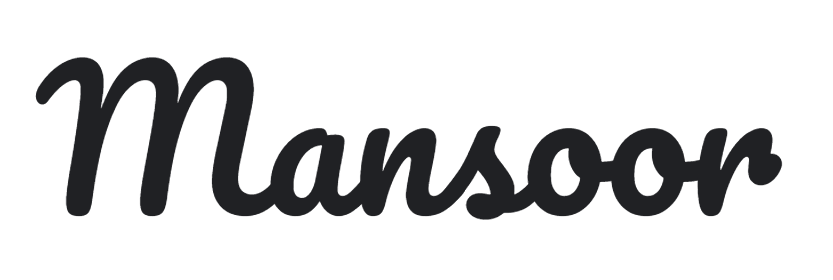

<!-- PROJECT LOGO -->
<br />
<p align="center">
  <a href="https://www.mycareerhunt.com">
    
  </a>

  <h3 align="center">My Career Hunt Job Portal</h3>

  <p align="center">
    Find your dream job with My Career Hunt!
    <br />
    <a href="https://www.mycareerhunt.com"><strong>Explore the website »</strong></a>
    <br />
    <br />
    <a href="https://github.com/your-username/my-career-hunt/issues">Report Bug</a>
    ·
    <a href="https://github.com/your-username/my-career-hunt/issues">Request Feature</a>
  </p>
</p>

<!-- TABLE OF CONTENTS -->
## Table of Contents

- [About the Project](#about-the-project)
  - [Built With](#built-with)
- [Getting Started](#getting-started)
  - [Installation](#installation)
  - [Usage](#usage)
- [Contributing](#contributing)
- [License](#license)
- [Contact](#contact)

<!-- ABOUT THE PROJECT -->
## About The Project

[](https://www.mycareerhunt.com)

My Career Hunt is a modern job portal that helps job seekers find the perfect job. It provides a user-friendly interface to search for job openings, internships, and build professional resumes. With My Career Hunt, your dream job is just a few clicks away.

### Built With

- [HTML](https://reactjs.org/)
- [CSS](https://nodejs.org/)
- [Jvascript](https://www.mongodb.com/)
- [Bootstrap](https://expressjs.com/)


## Screenshots

Here are some screenshots of the My Career Hunt Job Portal:

1. Homepage
   

2. Job Notifications
   

3. Internships
   

4. Resume Builder
   

5. About Us
   

6. Contact Us
   
<!-- GETTING STARTED -->
## Getting Started

To get a local copy up and running, follow these simple steps.

### Installation

1. Clone the repo
   ```sh
   git clone https://github.com/your-username/my-career-hunt.git .


## Contributing

We welcome contributions from the open-source community to improve My Career Hunt. To contribute, please follow these guidelines:

1. Fork the repository and create your branch: `git checkout -b feature/my-feature`
2. Make your changes and test them locally.
3. Commit your changes: `git commit -m "Add my feature"`
4. Push to the branch: `git push origin feature/my-feature`
5. Open a pull request to the `main` branch of the original repository.


Please ensure that your code adheres to the project's coding conventions and practices.

## License

This project is licensed under the [MIT License](LICENSE). Feel free to modify and distribute it as per the license terms.

## Contact

If you have any questions, suggestions, or feedback, please reach out to us:

- Email: [info@mycareerhunt.com](mailto:info@mycareerhunt.com)
- Website: [www.mycareerhunt.com](https://www.mycareerhunt.com)
- Twitter: [@mycareerhunt](https://twitter.com/mycareerhunt)

We value your input and appreciate your support in making My Career Hunt a better job portal for everyone.

Thank you for choosing My Career Hunt! Happy job hunting!
